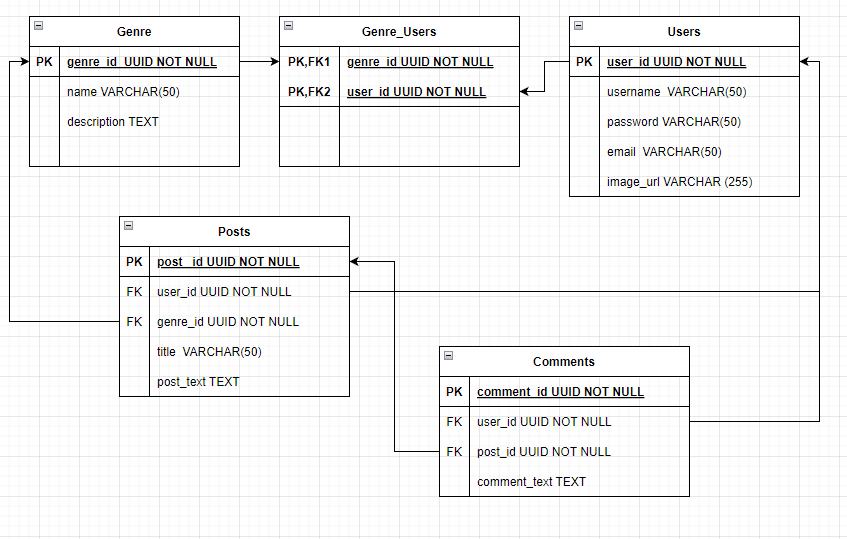

# Music Focused Social Media App

project by Zach, Caleb and Owen

## ***INSERT DEPLOYED PROJECT LINK HERE

# Project Description
This project creates a social media app that uses music to connect like minded users. Music information will be pulled from the Spotify API and user information will be stored on a postgres database.
## Install requirements

## Technologies used
- Node
- Postgres

## Spotify API Documentation
- https://developer.spotify.com/documentation/web-api/
## Back-End Documentation

### Routes

| METHOD | PATH                                  | PURPOSE                                        |
| ------ | ----------------------------          | ---------------------------------------------- |
| GET    | /                                     | HOME                                           |
| GET    | /genres                               | GENRES PAGE                                    |
| POST   | /genres                               | ADDS A GENRE                                   |
| GET    | /genres/:genre_id                     | A GENRE PAGE                                   |
| PUT    | /genres/:genre_id                     | EDITS A GENRE                                  |
| DELETE | /genres/:genre_id                     | DELETES A GENRE                                |
| POST   | /genres/:genre_id/posts               | POSTS USER POSTS TO THE GENRE PAGE             |
| DELETE | /genres/:genre_id/posts/:post_id      | DELETES USER POSTS FROM THE GENRE PAGE         |
| GET    | /posts                                | POSTS PAGE                                     |
| POST   | /posts                                | ADDS A POST                                    |
| GET    | /posts/:post_id                       | A POST PAGE                                    |
| PUT    | /posts/:post_id                       | EDITS A POST                                   |
| DELETE | /posts/:post_id                       | DELETES A POST                                 |
| POST   | /posts/:post_id/comments              | POSTS USER COMMENTS TO THE POSTS PAGE          |
| DELETE | /posts/:post_id/comments/:comment_id  | DELETES USER COMMENTS FROM THE POST PAGE       |

# Requirements

## MVP
- Connection to the Spotify API
- Postgres database for user information
- Account login information 
- Functionality to like/dislike genres, bands, albums, and songs
- Recommends other users based on similar preferences and show a feed of posts by them
- Profile Page to display info to other users
- Functionality to make posts about music or bands
## Post MVP
- Functionality to share and rate playlists
- Functionality to share user created music
- Functionality to help users create their own bands
- Functionality to track and post upcoming events and concerts
## Future Plans
- Can be added to as we go

## Project Requirements
- Your back-end uses Python or Node.
- Your back-end uses Flask or Django (Python) or Express (Node).
- Your front-end may use React, or another front-end framework (e.g., Vue, Angular), or a template language (EJS, Pug, Handlebars).
- Your app must have a database that has at least two tables (SQL) or collections (Mongo).
- Your database must support at least one type of database relationship between tables/collections.
    - This can be embedded or relational data in Mongo (An embedded collection will qualify as your second collection).
    - This can be a 1:M (one-to-many) or N:M (many-to-many) relationship between SQL tables.
- Your app uses an ORM or ODM to interact with your database (e.g., Sequelize, PyMongo, SQLAlchemy, TypeORM, Mongoose).
- This app must run in a web browser.
- Your website should be responsive to screen size changes.
    - This means that your website should be viewable and usable on a mobile device or tablet via an internet browser. Text shouldn't be super tiny and layouts shouldn't exceed the screen size on smaller screens.
- The app should have a README.md file including the following:
    - Describes the inspiration for the application.
    - Describes how to use the application.
    - Lists the technologies used to build the application.
    - Addresses any outstanding bugs or unfinished functionality.
# Planning

## Project Schedule
| DATE       | GOALS                                 |
|------------|---------------------------------------|
| Sun. 12/4 | Project Planning |
|    Tue. 12/6        |        Have project skeleton completed                              |
|Thu. 12/8|                    Get front and back-ends working together. Get Postgres database working                  |
|Sun. 12/11|                                    Get more pages, more styling, more endpoints, and more functionality working   |
|Tues. 12/13|                  Have MVP Criteria Completed.                    |
|Thu. 12/15|         Submit completed project. Project presentations                              |
## Front-End Wireframe

## Back-End ERD

# Outstanding Issues
## Bugs
## Unfinished Functionality

